# CMPM163Labs
Work for Game Graphics and Real-Time Rendering at UCSC Spring 20
By Jialin(Curry) Xu

## Lab2
Part 1 link: https://drive.google.com/open?id=1BDhBHd_NgVBAyQNoYGIJVo6yeKxpijSx

Part 2: 
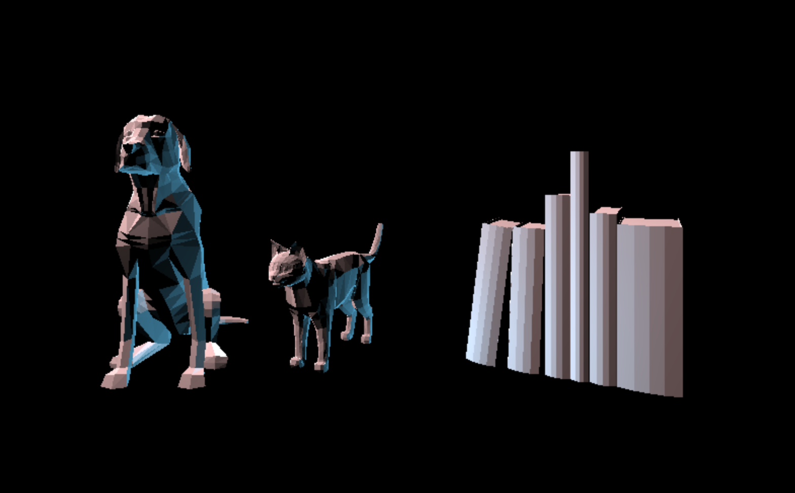

## Lab3
On the top roll are the cubes made with THREE.js library materials, from left to right are: MeshPhysicalMaterial(with modify of metalness, roughness, clearcoat, clearcoatRoughness and reflectivity), MeshPhongMaterial(the one in doc), MeshToonMaterial(with modify of color and shininess)

On the bottom roll are the cubes I made with custom shaders. The left one is an interpolation between red, green and blue. I was trying to make the rainbow effect but no success there. The one on the right is the one I made following the doc.

Video: https://drive.google.com/open?id=1F2C6pqBcxOd7lEEEZVICbbpeDR9draTm

## Lab4
Answer to 24:
a) The formula should be: u value of uv coordinate * width of texture size (u * 8) 
b) The formula should be: v value of uv coordinate * height of texture size (v * 8) 
c) The color sampled at uv coordinate (0.375, 0.25) should be grey if bottom left corner is (0,0)

Top roll cubes from left to right are: part 1 Texture A (uses three.js built in texture functionality), part 1 Texture A & Normal Map A (uses three.js built in texture functionality) and part 1 Texture B & Normal Map B (new texture/normal map combo using built in three.js functionality).
Bottom roll cubes from left to eight are: part 2 Texture C (load this texture with shaders, as we worked through in the lab together) and part 2 Texture D (tile this texture at least by showing a 2x2 grid).

How I solved Cube5: 
In the vertex shader I used for cube5, I make uVu = uv *2.0, which shinks the whole uv coordinate system by 1/2 and make it only covers 1/4 of the surface. Then in my fragment shader I used gl_FragColor = texture2D(texture2, mod (vUv,1.0)) so when the shader is trying to color the place where the uVu cannot reach, it will warp correctly.

Video: https://drive.google.com/open?id=1PJJwNybhlolk2f450P0ukQMKfXdzyOar

## Lab5 
Part 2a: 
Video: https://drive.google.com/open?id=1VoBngNZ59c2tZ0zdZeUV-aA4dTnnKk6u

Part 2b:
Video: https://drive.google.com/open?id=11GniFfoS1oc9UQcHTTv0iVJdwOeAsa1q

Part 2b modify:
The way I modify the particle system is to combine the previous two parts and first populate the whole screen with moving particles, and when the particles hit the boundary I set, their position will reset to the mouse and there will be a little particle fountain where the mouse is pointing. I also replaced the texture for the particles.
Video: https://drive.google.com/open?id=1i6Cw49kvI1z96Q0NMW5khVcvozy4UkT4

Unity project:
I modified the track with a more bunpy one, switch the texture for the first tree on the right to a rock texture and added some buildings into the scene. Also I add in some speed boost.
Video: https://drive.google.com/open?id=1Gze1mhdnvJl3OEcvVZ53cSlaAQeKfx5s

## Lab6
### Unity
Lighting Overview & Lights:
Point light: Act like a light bulb, sends light out in all directions equally. It light up the scebe based on the location of the point light, the rotation of the light doesn't matter. 
Directional light: Act like the sun. Lights up all the objects in the scene, based on the direction of the light set by the rotation of the directional light, position doesn't matter. 
Spot light:  Act like a flash light. Lights up the object in the cone area. Both position & rotation of a spot light matter.
Area light: Shine in all direction uniformly from one side of a defined rectangle. 

Materials & The Standard Shader:
I find the picture of a towel online, and imprt into the NVIDIA software to convert it into the normal map of the picture, then import both the texture and the normal map into the Unity. Then I put then both into a material, and adjust the metalic value to 0 and the source to albedoi alpha to make the materila look not so shiny. 
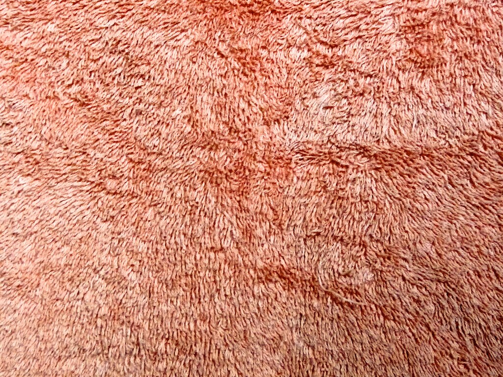\
The towel\
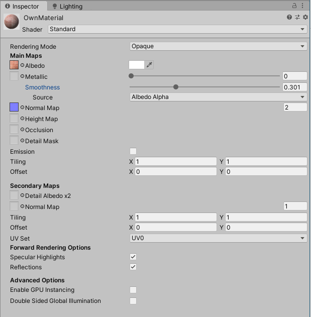\
The material in Unity

Textures:
Both of the textured objects are imported from the asset store. One is the Unity offical Unity-chan! and the other is a gun model. 

Skybox:
Skybox in Unity is the texture drawn behind all the object in the scene to represent the sky. I import the one in my scene from the asset store.

And this is the final result\
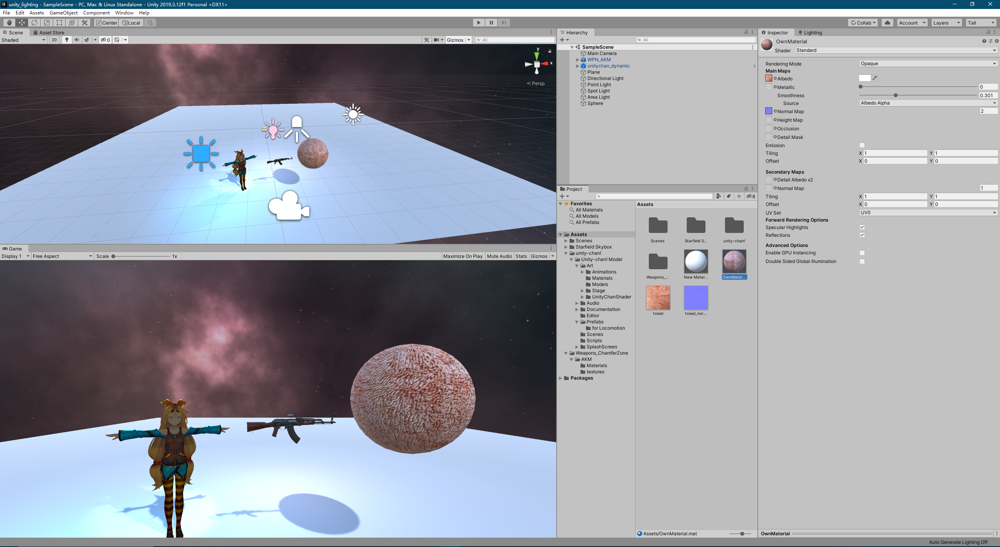

### Shadertoy
First screenshot of step13:\
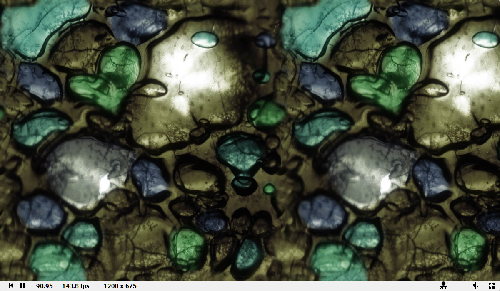

My Shadertoy project:\
https://www.shadertoy.com/view/WdlfWl#

Cool project:\
https://www.shadertoy.com/view/MsSGWK

## Lab7 
Part 1:
Video: https://drive.google.com/open?id=1pgWxl3X7Mf1l2dcOwQsG4p9UHIuksJc0 \
In the scene, I made the terrain and the water based on the turtoial, and the shader for the green part of the tree is a modified ground shader. I import the objects from the URP example and assect store to make a beach workshop where 2 people trying to make a boat and escape. 

-Which part did they do? \
My partener did part 2. \
-Which part of a tutorial did your partner find most challenging? \
The hardest part for my partener is the last part, since there're more than one object and their positions play an important role. \
-Which part of a tutorial did your partner find most interesting? \
My partener like part 2b the most, since the animation looks cool with the lighting. \

## Lab8
Part2:
My inspiration: \
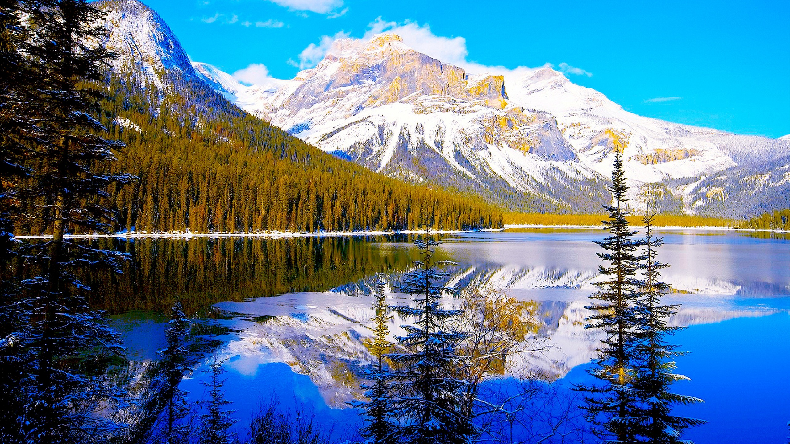 \ 
My project: \
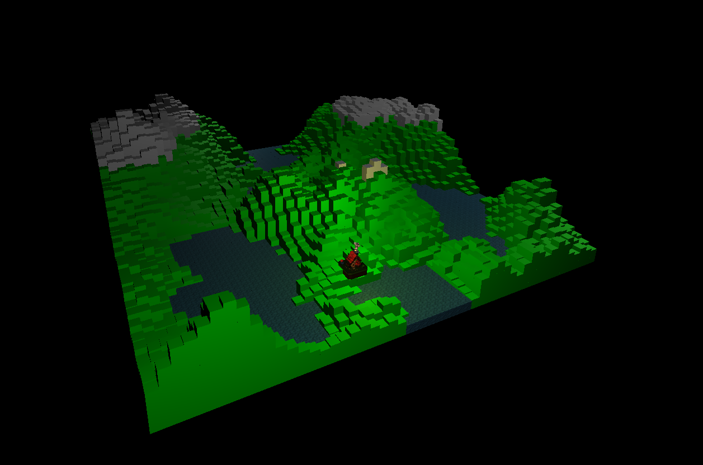 \
For lab8, instead of a modern city with lots of buildings, I went for the idea of a more nature look. I first follow the lab handout to map the perlin noise onto the THREE.js canvas, then I cut off the value lower than a certain point to represent lake area. I also map additional texture and normal map to make it looks real. Then I changed the color of blocks higher than a value to represent snowy mountain, also I changed the shininess of the material. Finally I load in a house I found online and add a warm yellow light to make it looks cool.

My partener did part1 of the lab. He/she went for a futuristic and cartoony style in Unity and the most cool thing I think in the project is that there are a lot of custom model in the project.

## Lab9
The example rule:
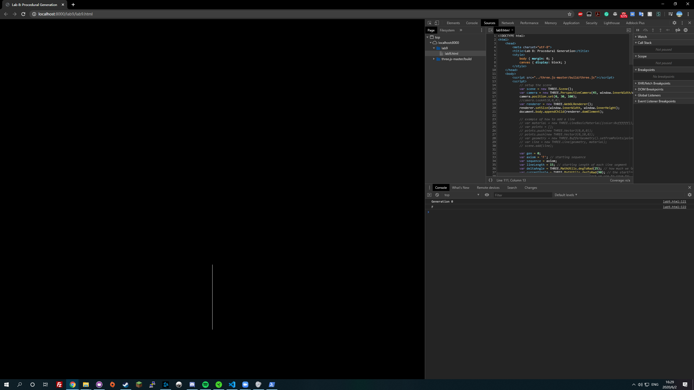 \
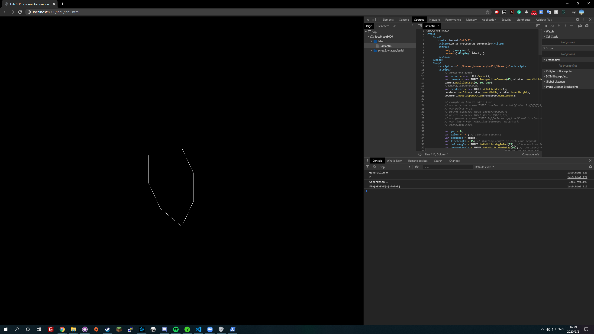 \
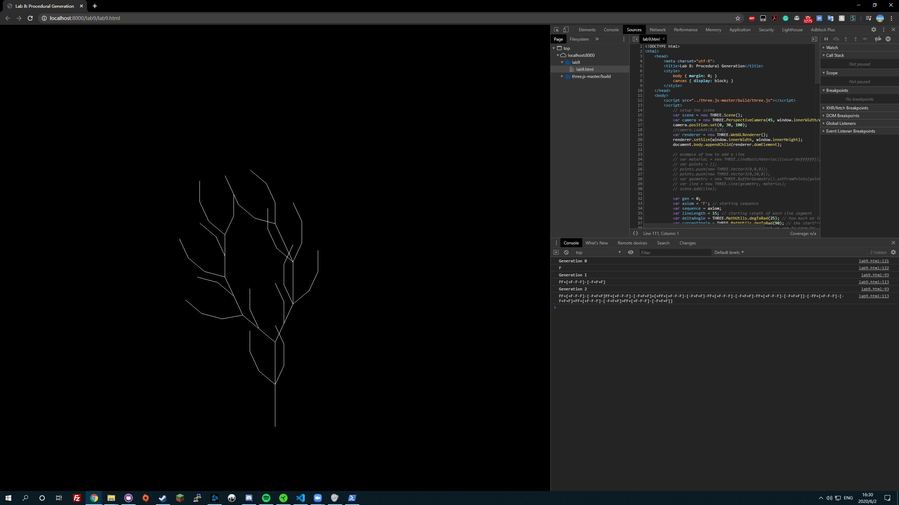 \
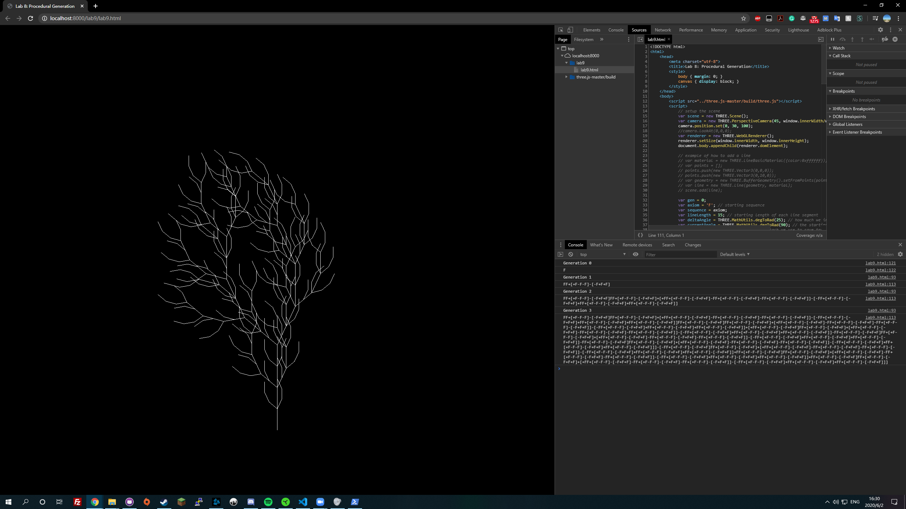 \
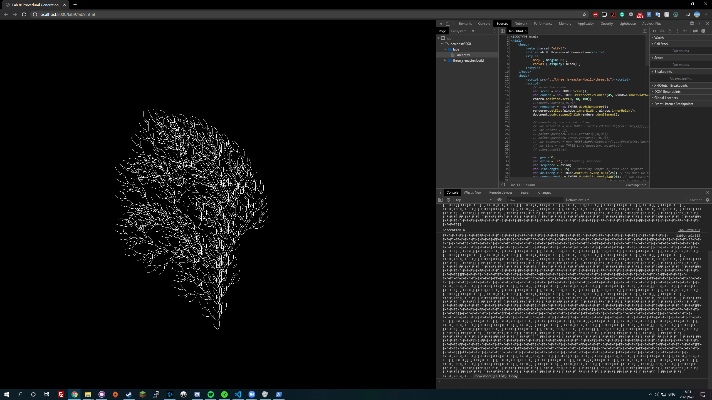 

My own rule: \
F[+FF][-FF]F[-F][+F]F \
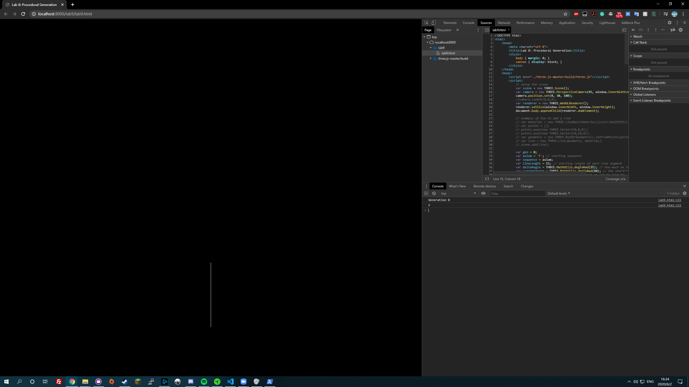 \
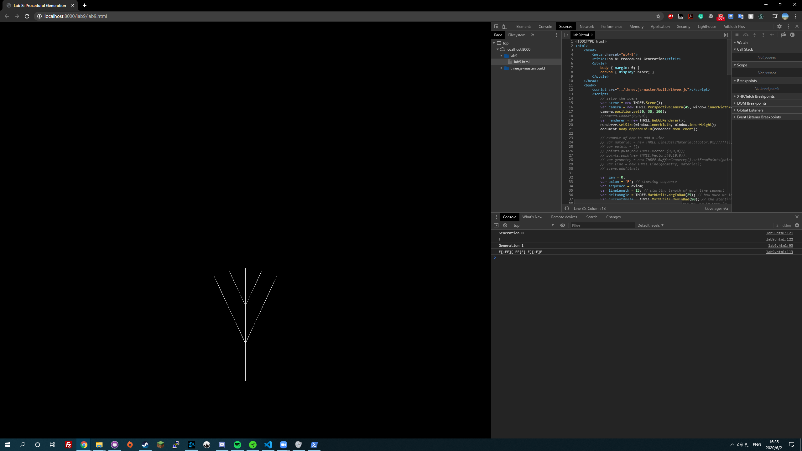 \
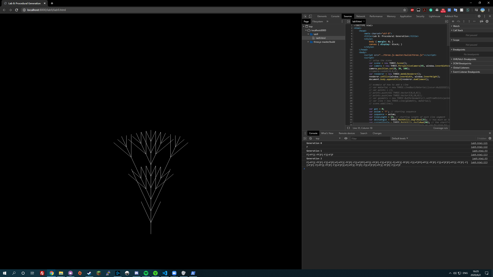 \
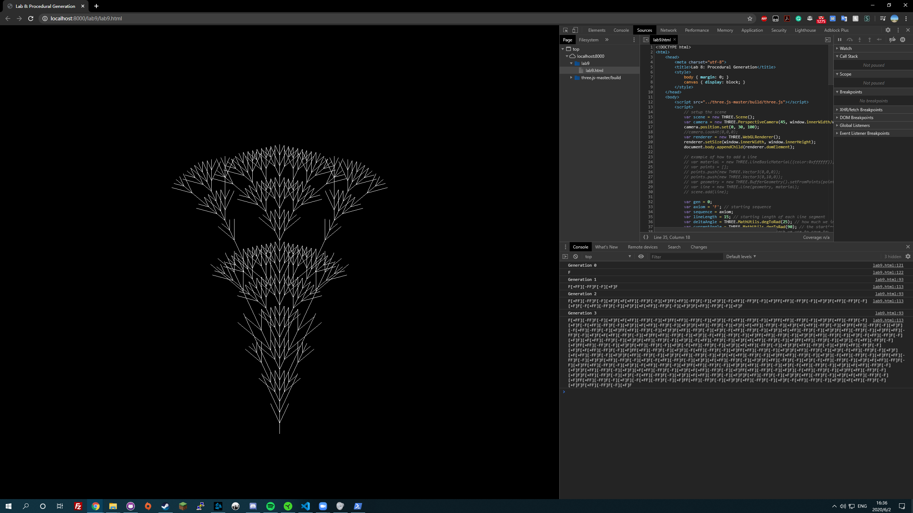 
