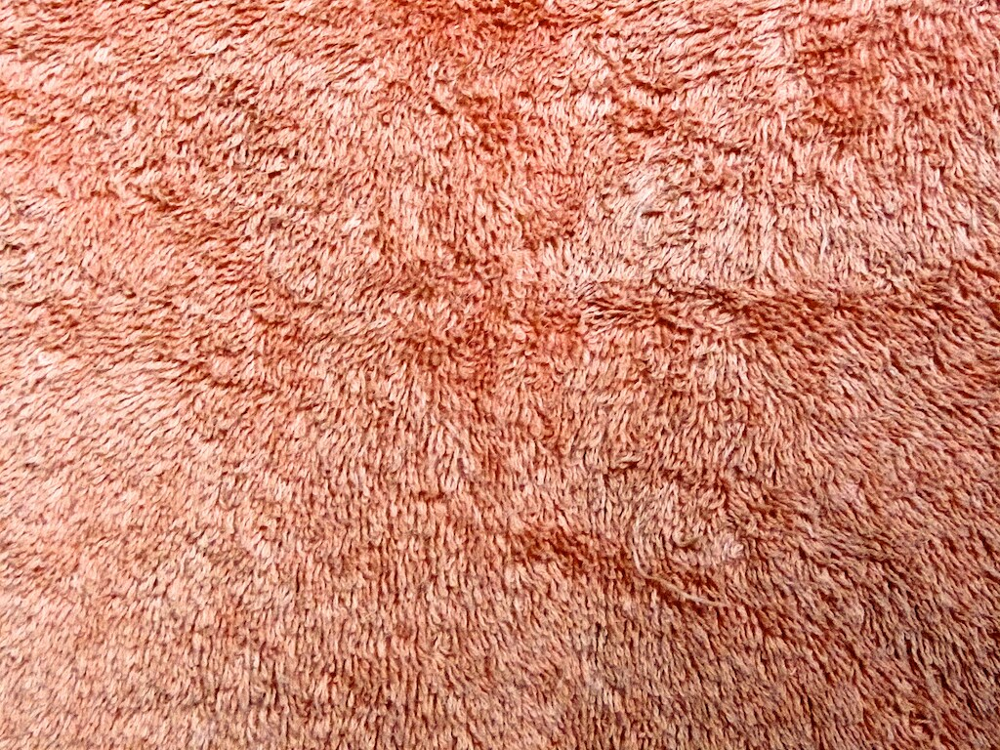
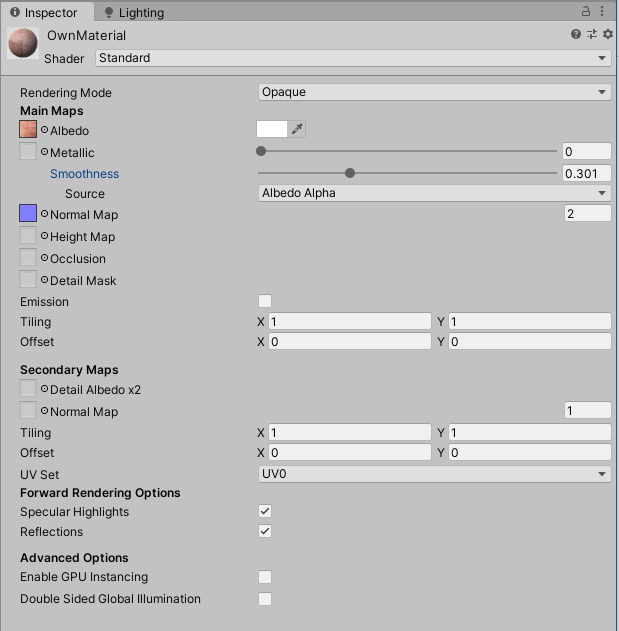
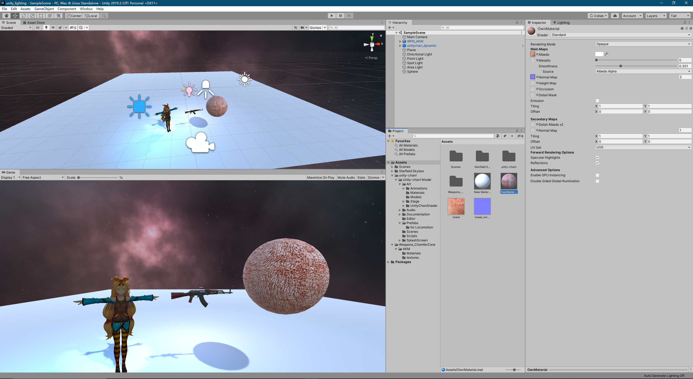
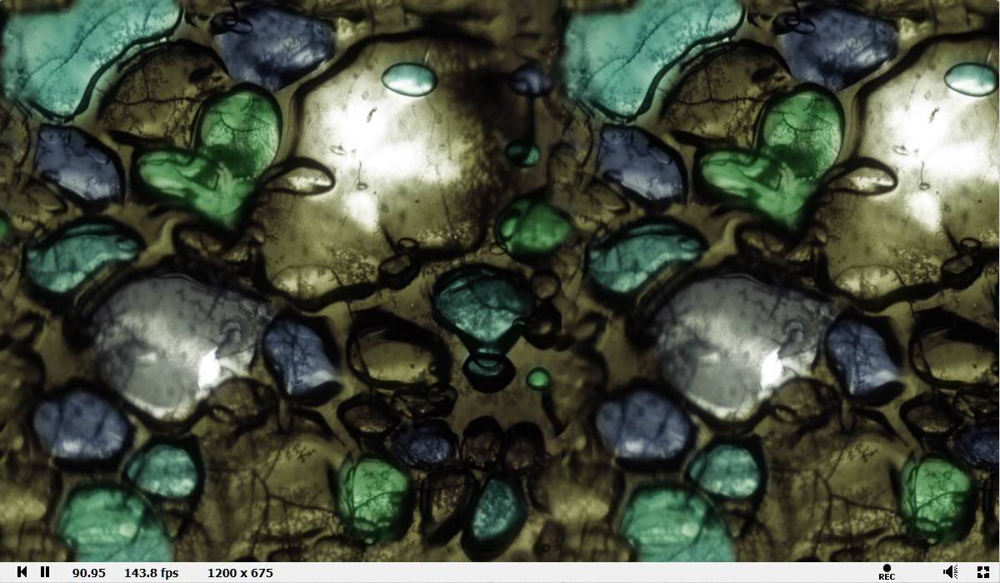

# Lab 6
## Unity
Lighting Overview & Lights:
Point light: Act like a light bulb, sends light out in all directions equally. It light up the scebe based on the location of the point light, the rotation of the light doesn't matter. 
Directional light: Act like the sun. Lights up all the objects in the scene, based on the direction of the light set by the rotation of the directional light, position doesn't matter. 
Spot light:  Act like a flash light. Lights up the object in the cone area. Both position & rotation of a spot light matter.
Area light: Shine in all direction uniformly from one side of a defined rectangle. 

Materials & The Standard Shader:
I find the picture of a towel online, and imprt into the NVIDIA software to convert it into the normal map of the picture, then import both the texture and the normal map into the Unity. Then I put then both into a material, and adjust the metalic value to 0 and the source to albedoi alpha to make the materila look not so shiny. 
\
The towel\
\
The material in Unity

Textures:
Both of the textured objects are imported from the asset store. One is the Unity offical Unity-chan! and the other is a gun model. 

Skybox:
Skybox in Unity is the texture drawn behind all the object in the scene to represent the sky. I import the one in my scene from the asset store.

And this is the final result\

## Shadertoy
First screenshot of step13:\

My Shadertoy project:\
https://www.shadertoy.com/view/WdlfWl#

Cool project:\
https://www.shadertoy.com/view/MsSGWK